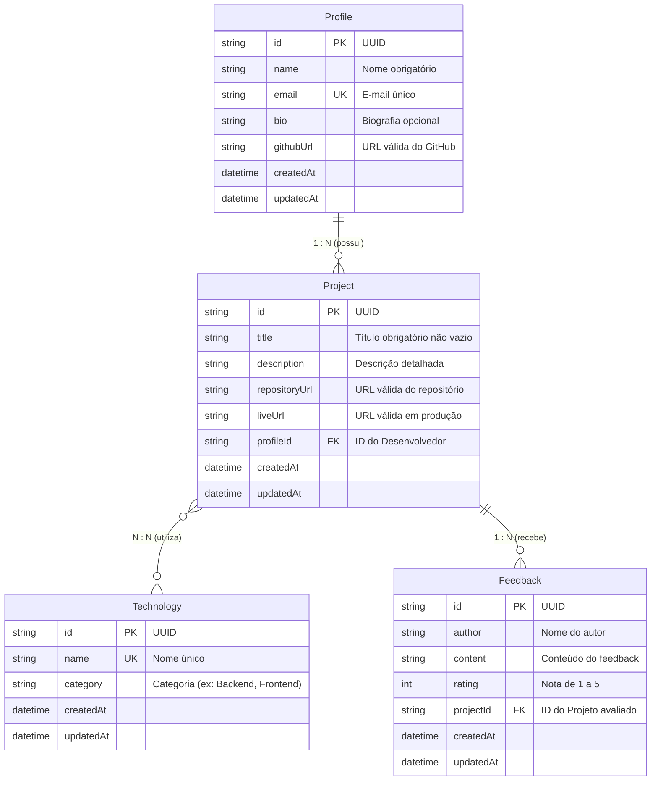

# 🚀 DevShowcase API - Etapa 1

Backend RESTful da plataforma **DevShowcase**, desenvolvido com **Node.js**, **Express**, **TypeScript**, **Prisma ORM** e **SQLite**. O projeto implementa a fundação arquitetural da aplicação com modelagem de domínio, persistência relacional, validação de DTOs e endpoints REST completos.

---

## 📌 Requisitos da Etapa 1 Atendidos

1. **Configuração e Repositório**:
   - Stack: Node.js, Express e TypeScript.
   - Arquivo `.gitignore` devidamente configurado para Node.js, Prisma, SQLite e ambientes locais.
2. **Modelagem de Entidades Relacionais**:
   - `Profile` (Perfil do Desenvolvedor)
   - `Project` (Projeto)
   - `Technology` (Tecnologia)
   - `Feedback` (Opinião)
   - Relacionamentos mapeados:
     - `Profile` **1 : N** `Project`
     - `Project` **N : N** `Technology`
     - `Project` **1 : N** `Feedback`
3. **Camada de Acesso a Dados e DTOs**:
   - Camada de **Repositórios** (`src/repositories/`) isolando a persistência com Prisma Client.
   - **DTOs** (`src/dtos/`) com validações estritas usando **Zod** (títulos não vazios, URLs válidas com protocolo, formato de e-mail e notas entre 1 e 5).
4. **Endpoints REST Implementados**:
   - `POST /api/profiles` (Cadastro de perfil com validações)
   - `GET  /api/profiles/:id` (Buscar perfil por ID com projetos)
   - `POST /api/technologies` (Cadastro de tecnologia com validação de unicidade)
   - `GET  /api/technologies` (Listagem de tecnologias)
   - `POST /api/projects` (Cadastro de projeto com validações e relacionamentos)
   - `GET  /api/projects` (Listagem de projetos com autores e tecnologias)
   - `POST /api/feedbacks` (Cadastro de feedback para um projeto)
   - `GET  /api/feedbacks/project/:projectId` (Listagem de feedbacks por projeto)
5. **Documentação e Testes (Postman & Swagger)**:
   - Documentação interativa completa via **Swagger UI** (`/docs`).
   - Coleção de testes completa no **Postman** (`postman/DevShowcase_API.postman_collection.json`) com variáveis dinâmicas e testes de fluxos de sucesso e validação.

---

## 🏛️ Diagrama de Relacionamentos (ERD)



---

## 📂 Estrutura do Projeto

```text
├── prisma/
│   └── schema.prisma         # Modelagem relacional e configuração do Prisma ORM
├── postman/
│   └── DevShowcase_API.postman_collection.json # Coleção Postman pronta para importação
├── src/
│   ├── controllers/          # Controladores HTTP com tratamento de requisições
│   │   ├── profile.controller.ts
│   │   ├── technology.controller.ts
│   │   ├── project.controller.ts
│   │   └── feedback.controller.ts
│   ├── docs/                 # Documentação Swagger UI e diagrama relacional
│   │   ├── schema-prisma.svg.ts
│   │   ├── swagger-ui.custom.ts
│   │   └── swagger.spec.ts
│   ├── dtos/                 # Schemas Zod de validação de entrada e DTOs de saída
│   │   ├── profile.dto.ts
│   │   ├── technology.dto.ts
│   │   ├── project.dto.ts
│   │   └── feedback.dto.ts
│   ├── lib/                  # Instância Singleton do PrismaClient
│   │   └── prisma.ts
│   ├── middlewares/          # Validador Zod, logger colorido e tratamento global de erros
│   │   ├── validate.middleware.ts
│   │   ├── logger.middleware.ts
│   │   └── error.middleware.ts
│   ├── repositories/         # Padrão Repository (Camada de acesso a dados)
│   │   ├── profile.repository.ts
│   │   ├── technology.repository.ts
│   │   ├── project.repository.ts
│   │   └── feedback.repository.ts
│   ├── routes/               # Definição e roteamento das rotas REST
│   │   ├── database.routes.ts
│   │   ├── profile.routes.ts
│   │   ├── technology.routes.ts
│   │   ├── project.routes.ts
│   │   ├── feedback.routes.ts
│   │   └── index.ts
│   ├── utils/                # Funções utilitárias de limpeza de banco
│   │   └── database.util.ts
│   ├── app.ts                # Inicialização do Express e Swagger UI
│   └── server.ts             # Ponto de entrada do servidor HTTP
├── tsconfig.json             # Configuração do TypeScript
├── package.json              # Dependências e scripts do projeto
└── README.md                 # Documentação principal
```

---

## 🛠️ Como Instalar e Executar

### Pré-requisitos
- **Node.js** (versão 18 ou superior - recomendado v20 ou v22)
- **npm** (já incluso no Node.js)

### 1. Clonar e Instalar Dependências
```bash
git clone <URL_DO_SEU_REPOSITORIO>
cd Trabalho
npm install
```

### 2. Configurar o Banco de Dados (SQLite com Prisma)
Gere o cliente do Prisma e aplique o esquema no banco SQLite local:
```bash
npx prisma db push
```

### 3. Iniciar o Servidor em Modo de Desenvolvimento
```bash
npm run dev
```
A API e a documentação interativa estarão disponíveis em:
- **Swagger UI:** `http://localhost:3000` (ou `http://localhost:3000/docs`)
- **Status da API:** `http://localhost:3000/api`

---

## 📬 Como Utilizar a Coleção do Postman

1. Abra o **Postman**.
2. Clique no botão **Import** e selecione o arquivo:
   `postman/DevShowcase_API.postman_collection.json`.
3. A coleção já inclui a variável `baseUrl` (`http://localhost:3000/api`) e scripts automáticos que salvam os IDs de perfis, tecnologias e projetos gerados.
4. Execute as requisições na ordem indicada para testar os cadastros com sucesso e os cenários de validação (status 400 e 409).
