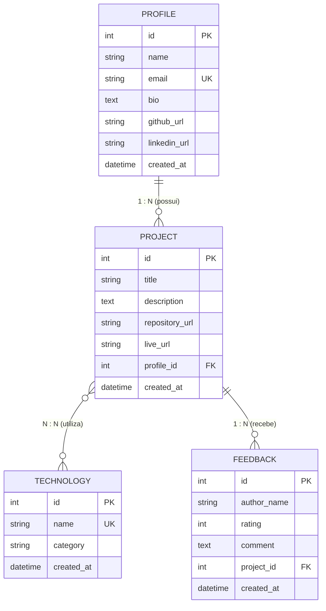

# 🚀 DevShowcase API

> **API RESTful para catálogo e compartilhamento de portfólios, projetos e tecnologias de desenvolvedores.**  
> *Projeto desenvolvido para a etapa prática de **Modelagem de domínio, persistência e endpoints básicos**.*

---

## 📋 Sumário
- [Visão Geral](#-visão-geral)
- [Tecnologias Utilizadas](#-tecnologias-utilizadas)
- [Arquitetura & Estrutura de Pastas](#-arquitetura--estrutura-de-pastas)
- [Modelagem de Dados e Relacionamentos](#-modelagem-de-dados-e-relacionamentos)
- [Endpoints da API](#-endpoints-da-api)
- [Como Executar a Aplicação](#-como-executar-a-aplicação)
- [Executando os Testes Automatizados](#-executando-os-testes-automatizados)
- [Povoamento de Dados (Seed)](#-povoamento-de-dados-seed)
- [Testes via Postman](#-testes-via-postman)
- [Documentação Interativa (Swagger)](#-documentação-interativa-swagger)

---

## 💡 Visão Geral

A **DevShowcase API** é a base arquitetural para uma plataforma de vitrine técnica para desenvolvedores. O sistema permite cadastrar perfis, registrar tecnologias dominadas, publicar projetos associados aos perfis e receber avaliações/feedbacks sobre as criações.

### Destaques do Projeto:
- **Banco de Dados Relacional**: Implementação com SQLAlchemy ORM e suporte a Foreign Keys no SQLite.
- **Relacionamentos Completos**:
  - `Profile 1 : N Project`
  - `Project N : N Technology` (via tabela associativa)
  - `Project 1 : N Feedback`
- **Validação Estrita de DTOs**: Garantia de formatos válidos para URLs, campos de texto não vazios, e-mails únicos e limites de avaliação com **Pydantic v2**.
- **Repository Pattern**: Desacoplamento entre a camada de persistência e os controladores REST.
- **Alta Cobertura de Testes**: Suíte automatizada com `pytest` e `httpx`.

---

## 🛠️ Tecnologias Utilizadas

- **Linguagem**: Python 3.11+
- **Framework Web**: [FastAPI](https://fastapi.tiangolo.com/)
- **ORM / Persistência**: [SQLAlchemy 2.0](https://www.sqlalchemy.org/)
- **Validação & Serialização**: [Pydantic v2](https://docs.pydantic.dev/)
- **Banco de Dados**: SQLite (com suporte nativo a constraints relacionais)
- **Servidor ASGI**: [Uvicorn](https://www.uvicorn.org/)
- **Testes Automatizados**: [Pytest](https://docs.pytest.org/) e [HTTPX](https://www.python-httpx.org/)

---

## 🏗️ Arquitetura & Estrutura de Pastas

```text
Trabalho/
├── app/
│   ├── database.py              # Configuração do banco SQLite e sessão SQLAlchemy
│   ├── main.py                  # Aplicação FastAPI, CORS, rotas e documentação
│   ├── models/                  # Entidades relacionais (ORM)
│   │   ├── associations.py      # Tabela intermediária project_technologies (N : N)
│   │   ├── profile.py           # Entidade Profile (1 : N com Project)
│   │   ├── project.py           # Entidade Project (N:N com Tech, 1:N com Feedback)
│   │   ├── technology.py        # Entidade Technology (N : N com Project)
│   │   └── feedback.py          # Entidade Feedback (1 : N com Project)
│   ├── schemas/                 # DTOs de Entrada e Saída com Validações
│   │   ├── profile.py
│   │   ├── project.py
│   │   ├── technology.py
│   │   └── feedback.py
│   ├── repositories/            # Camada de Persistência (Data Access Layer)
│   │   ├── base.py
│   │   ├── profile_repository.py
│   │   ├── project_repository.py
│   │   ├── technology_repository.py
│   │   └── feedback_repository.py
│   └── routers/                 # Controladores RESTful
│       ├── profiles.py
│       ├── technologies.py
│       ├── projects.py
│       └── feedbacks.py
├── tests/                       # Testes automatizados isolados
│   ├── conftest.py              # Fixtures com banco SQLite em memória
│   ├── test_profiles.py
│   ├── test_technologies.py
│   ├── test_projects.py
│   └── test_feedbacks.py
├── postman/
│   └── DevShowcase_API.postman_collection.json # Coleção pronta para o Postman
├── scripts/
│   └── seed_data.py             # Script de povoamento inicial do banco
├── ROTEIRO_APRESENTACAO.md      # Roteiro passo a passo para gravação do vídeo
├── GUIA_ENTREGA_GITHUB_PDF.md   # Guia de publicação no GitHub e envio do PDF
├── ENTREGA_FINAL.html           # Modelo pronto para impressão em PDF da entrega
├── requirements.txt             # Dependências do projeto
└── README.md
```

---

## 🗄️ Modelagem de Dados e Relacionamentos



---

## 🌐 Endpoints da API

| Método | Rota | Descrição | Status Sucesso | Validações Principais |
|---|---|---|---|---|
| `POST` | `/api/profiles` | Cadastra um novo perfil de desenvolvedor | `201 Created` | URLs válidas, e-mail único, nome não vazio |
| `GET` | `/api/profiles/{id}` | Busca perfil por ID com seus projetos (1:N) | `200 OK` | Retorna 404 se não encontrado |
| `GET` | `/api/profiles` | Lista todos os perfis | `200 OK` | Paginação suportada (`skip`, `limit`) |
| `POST` | `/api/technologies` | Cadastra uma nova tecnologia | `201 Created` | Nome único, campos não vazios |
| `GET` | `/api/technologies` | Lista todas as tecnologias cadastradas | `200 OK` | - |
| `POST` | `/api/projects` | Cadastra projeto vinculado a perfil e tecnologias | `201 Created` | URLs válidas, verifica integridade das FKs |
| `GET` | `/api/projects` | Lista projetos com autor, tecnologias e feedbacks | `200 OK` | - |
| `GET` | `/api/projects/{id}` | Busca detalhes de um projeto específico | `200 OK` | Retorna 404 se não encontrado |
| `POST` | `/api/feedbacks` | Cadastra avaliação sobre um projeto | `201 Created` | Nota de 1 a 5, projeto existente |
| `GET` | `/api/feedbacks/project/{id}` | Lista feedbacks de um determinado projeto | `200 OK` | - |

---

## ⚙️ Como Executar a Aplicação

### 1. Pré-requisitos
- Python 3.11 instalado.

### 2. Ativar o Ambiente Virtual
No terminal PowerShell ou CMD:
```powershell
# Ativar venv no Windows PowerShell
.\venv\Scripts\Activate.ps1
```

### 3. Iniciar o Servidor FastAPI
Execute:
```powershell
.\venv\Scripts\uvicorn app.main:app --reload
```
A API estará acessível em: **`http://127.0.0.1:8000`**

---

## 🧪 Executando os Testes Automatizados

A aplicação inclui suíte completa de testes unitários e de integração utilizando banco de dados em memória isolado:

```powershell
.\venv\Scripts\pytest -v
```

---

## 🌱 Povoamento de Dados (Seed)

Para popular o banco local com perfis, tecnologias, projetos e feedbacks realistas para demonstração imediata no Postman:

```powershell
.\venv\Scripts\python scripts/seed_data.py
```

---

## 📮 Testes via Postman

1. Abra o **Postman**.
2. Clique no botão **Import** e selecione o arquivo:
   `postman/DevShowcase_API.postman_collection.json`.
3. A coleção já vem configurada com a variável `baseUrl` apontando para `http://127.0.0.1:8000`.
4. As pastas estão organizadas por entidade e incluem testes de validação (rejeição de URLs inválidas, notas fora de limite e e-mails duplicados).
5. Abra o **Postman Console** (`Alt + Ctrl + C` ou ícone no rodapé) para visualizar as requisições sendo executadas conforme solicitado nas regras de gravação.

---

## 📖 Documentação Interativa (Swagger)

Com a API em execução, acesse:
- **Swagger UI**: [http://127.0.0.1:8000/docs](http://127.0.0.1:8000/docs)
- **ReDoc**: [http://127.0.0.1:8000/redoc](http://127.0.0.1:8000/redoc)
